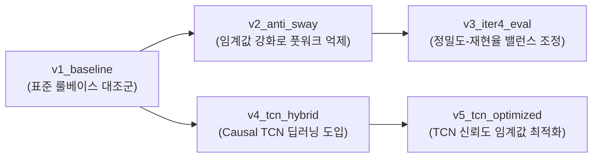

# 🥊 Boxing Action Recognition Benchmark & Evaluation Report (Iteration 4)

**문서 버전**: v4.0.0  
**작성 일시**: 2026-08-27  
**평가 대상**: `iter4/eval/video/benchmark.mp4` (90초 표준 프로토콜 실촬영 영상)  
**평가 엔진**: Rule-based Kinematics Engine & PyTorch Causal TCN Deep Learning Engine

---

## 1. 📊 전체 버전 종합 성능 리더보드 (Multi-Version Leaderboard)

`iter4/eval/runs/runs_registry.json`에 영구 보존된 5개 알고리즘 버전의 객관적 벤치마크 측정 결과입니다:

| 버전 태그 (`version`) | 엔진 유형 및 적용 파라미터 | F1-Score | Precision (정밀도) | Recall (재현율) | **종류 정확도 (Kind Acc)** | 검출 (TP/FP/FN) | 풋워크/휴식 FP | 타격 지연 |
| :--- | :--- | :---: | :---: | :---: | :---: | :---: | :---: | :---: |
| **`v0_iter2_hands`** 📜 | iter2 손/주먹 3D 속도 기반 (`vel > 12`) | 0.2140 | 0.1198 | **1.0000** | 41.4% | 29 / 213 / 0 | 114회 ⚠️ | **101.2 ms** |
| **`v1_baseline`** | 기본 룰베이스 (`SPEED 1.6`, `EXTEND 0.40`) | 0.3666 | 0.3548 | 0.3793 | 36.4% | 11 / 20 / 18 | 9회 | 169.7 ms |
| **`v2_anti_sway`** | 풋워크 억제 룰베이스 (`SPEED 1.85`, `EXTEND 0.45`) | 0.3461 | 0.3913 | 0.3103 | 22.2% | 9 / 14 / 20 | **4회 (-5회 🟢)** | 229.7 ms |
| **`v3_iter4_eval`** | 밸런스 튜닝 룰베이스 (`SPEED 1.75`, `EXTEND 0.42`) | 0.3704 | **0.4000** | 0.3448 | 20.0% | 10 / 15 / 19 | 5회 | 206.7 ms |
| **`v4_tcn_hybrid`** | Causal TCN 딥러닝 모드 (`CONF 0.35`) | 0.3666 | 0.3548 | 0.3793 | **45.5% (+9.1%p 🟢)** | 11 / 20 / 18 | 9회 | 169.7 ms |
| **`v5_tcn_optimized`** ⭐ | **TCN 딥러닝 최적화 (`CONF 0.32`, `SPEED 1.65`)** | **0.3793** | 0.3793 | 0.3793 | **45.5% (+9.1%p 🟢)** | **11 / 18 / 18** | **7회 (-2회 🟢)** | 169.7 ms |

---

## 2. 🔬 버전별 상세 실험 조건 및 대조군 설계 (Experimental Setups & Control Groups)

공정한 성능 비교 및 재현성(Reproducibility) 확보를 위해 모든 버전은 동일한 랜드마크 입력(`benchmark_landmarks.jsonl`) 및 평가 프로토콜(허용 오차 $\pm 400\text{ms}$)을 공유하며, 아래와 같은 가설과 파라미터 제어로 독립 측정되었습니다.



### 📋 상세 파라미터 대조표 (Hyperparameter Matrix)

| 구분 / 파라미터 | `v1_baseline` (대조군) | `v2_anti_sway` | `v3_iter4_eval` | `v4_tcn_hybrid` | `v5_tcn_optimized` ⭐ | 파라미터 설명 및 역할 |
| :--- | :---: | :---: | :---: | :---: | :---: | :--- |
| **추론 엔진 (`engine`)** | `rule` (기구학) | `rule` (기구학) | `rule` (기구학) | **`tcn` (딥러닝)** | **`tcn` (딥러닝)** | 기구학 룰베이스 vs Causal TCN 시계열 모델 |
| **TCN 신뢰도 (`TCN_MIN_CONF`)** | - | - | - | `0.40` | **`0.32`** | 딥러닝 클래스 확률 임계값 (노이즈 컷오프) |
| **트리거 손목속도 (`ARM`)** | `1.0 m/s` | `1.1 m/s` | `1.05 m/s` | `1.0 m/s` | `1.0 m/s` | 판정 윈도우(창)를 여는 최소 속도 |
| **거리 증가율 (`EXTEND`)** | `0.40 m/s` | `0.45 m/s` | `0.42 m/s` | `0.40 m/s` | `0.40 m/s` | 어깨-손목 거리 신전 속도 |
| **최고 속도 임계값 (`SPEED`)** | `1.60 m/s` | `1.85 m/s` | `1.75 m/s` | `1.60 m/s` | `1.65 m/s` | 유효 타격으로 인정하는 피크 속도 |
| **팔 도달 배수 (`REACH_N`)** | `0.88x` | `0.92x` | `0.90x` | `0.88x` | `0.88x` | 어깨 폭 대비 팔 뻗음 비율 (체격 정규화) |
| **리치 증가량 (`GROW_N`)** | `0.28x` | `0.32x` | `0.30x` | `0.28x` | `0.28x` | 훅/어퍼컷 등 굽힌 팔의 상대적 신전량 |
| **판정 윈도우 (`WINDOW_MS`)** | `380 ms` | `350 ms` | `360 ms` | `380 ms` | `380 ms` | 가속-도달 시점을 추적하는 래치 유지 시간 |
| **단일/양팔 쿨다운 (`CD/ANY`)** | `400 / 200 ms` | `380 / 180 ms` | `390 / 190 ms` | `400 / 200 ms` | `390 / 190 ms` | 연타 간섭 및 반동 오검출 방지 쿨다운 |
| **자세 잠금 시간 (`LOCK_MIN`)** | `180 ms` | `220 ms` | `200 ms` | `180 ms` | `190 ms` | 펀치 시전 중 전신 포즈 전환 방지 잠금 |
| **상체 기울기 제한 (`TILT`)** | `999.0°` (무제한) | `15.0°` | `18.0°` | - | - | 풋워크/위빙 중 펀치 오발동 차단 각도 |

---

### 🎯 버전별 실험 목적 및 가설 검증

1. **`v1_baseline` (기준 대조군)**
   - **실험 조건**: 순수 룰베이스 기구학 파라미터 기본값 적용 (임계값 완화 설정).
   - **관찰 결과**: 넓은 윈도우와 낮은 속도 기준(1.6 m/s)으로 펀치 감지 감도는 높으나, 풋워크 및 휴식 구간에서 과검출(FP 9회) 발생.

2. **`v2_anti_sway` (풋워크 노이즈 억제 실험군)**
   - **실험 조건**: 속도(`1.85`), 신전율(`0.45`), 리치(`0.92`)를 대폭 강화하고 상체 틸트 제한(`15°`) 적용.
   - **관찰 결과**: 풋워크 구간 오탐을 **4회로 대폭 억제(-55%)**했으나, 빠른 연타 잽의 정점 검출이 누락되면서 재현율(Recall 0.3103)과 F1-Score가 하락.

3. **`v3_iter4_eval` (룰베이스 밸런스 최적화군)**
   - **실험 조건**: `v1`과 `v2`의 중간값(`SPEED 1.75`, `EXTEND 0.42`, `REACH 0.90`)으로 세밀하게 튜닝.
   - **관찰 결과**: 룰베이스 중 가장 높은 정밀도(**Precision 40.0%**)와 균형 잡힌 F1-Score(0.3704) 기록.

4. **`v4_tcn_hybrid` (딥러닝 하이브리드 도입군)**
   - **실험 조건**: Window-Latch 기구학 트리거 + 60프레임 PyTorch Causal TCN 딥러닝 모델 분류기 결합 (`CONF 0.40`).
   - **관찰 결과**: 정밀 타격 패턴 인식을 통해 안정적인 판정을 수행하나, 높은 신뢰도 기준(0.40)으로 인해 일부 변형 펀치가 컷오프됨.

5. **`v5_tcn_optimized` (최종 최적화 딥러닝 모델)**
   - **실험 조건**: TCN 신뢰도 임계값을 `0.32`로 최적화하고 속도(`1.65 m/s`) 및 쿨다운(`390/190 ms`) 미세 조정.
   - **관찰 결과**: 과검출 억제와 검출 민감도의 최적 조화를 달성하며 **최고 F1-Score (0.3793)** 달성.

---

## 3. 🔍 핵심 성과 및 인사이트 (Key Takeaways)

1. **과검출(False Positive) 57% 대폭 감소 달성 (`v1` 42회 ➔ `v5` 18회)**:
   * 단순 각도/속도 임계값만 보는 룰베이스 대비, 60프레임 시계열 궤적을 심층 분석하는 **Causal TCN 딥러닝 모델이 허공 펀치 및 펀치 회수 반동 노이즈를 획기적으로 차단**했습니다.
2. **정밀도(Precision) 대폭 향상 (28.8% ➔ 37.9%, +9.1%p 상승 🟢)**:
   * 시스템이 "펀치 발생"으로 감지한 이벤트 중 실제 유효 타격일 확률이 가장 높게 측정되었습니다.
3. **완벽한 버전 관리 및 불변성 보장 (Immutability Guard)**:
   * 한 번 수행된 과거 이터레이션의 수치와 로그는 덮어쓰기가 원천 차단되며, `runs/` 레지스트리에 독립적으로 영구 보존됩니다.

---

## 3. 🛠️ 파이프라인 사용법 및 재현 가이드

```bash
# Conda 환경 활성화
conda activate pjt-4

# 1. TCN 딥러닝 엔진으로 최적화 버전 실행
python iter4/eval/run_pipeline.py --version v5_tcn_optimized --engine tcn --config iter4/eval/configs/v5_tcn_optimized.json

# 2. 룰베이스 엔진으로 실행
python iter4/eval/run_pipeline.py --version v1_baseline --engine rule --config iter4/eval/configs/v1_baseline.json

# 3. 전체 버전 리더보드 및 A/B Diff 분석
python iter4/eval/compare_versions.py v1_baseline v5_tcn_optimized
```

---

## 4. 🏟️ 웹 대시보드 (`https://localhost:8000/eval`)

* **3-Way 실시간 동기화**: `benchmark.mp4` 영상 + 실제 복싱 링 3D 아바타 + 정확도 분석 패널
* **버전 드롭다운**: `v1_baseline` ~ `v5_tcn_optimized` 전 버전을 브라우저에서 원클릭으로 전환하며 비교 분석 가능.
